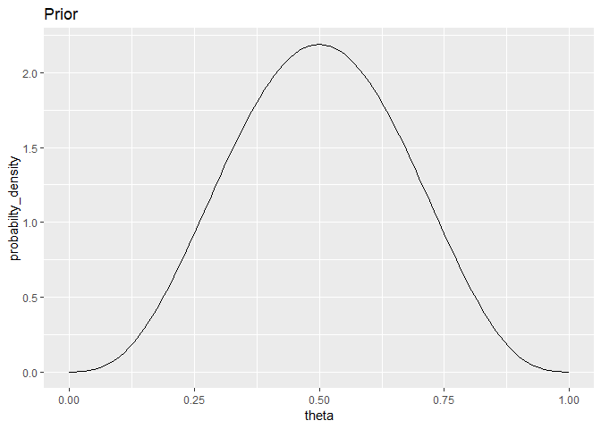

Chapter 02 – Exercise01
================
Jan Kraemer
2 May 2019

## The Question

Posterior inference: suppose you have a \(Beta(4, 4)\) prior
distribution on the probability \(\theta\) that a coin will yield a
‘head’ when spun in a specified manner. The coin is independently spun
ten times, and ‘heads’ appear fewer than 3 times. You are not told how
many heads were seen, only that the number is less than 3. Calculate
your exact posterior density (up to a proportionality constant) for
\(\theta\) and sketch it.

## Answer

### The Prior

``` r
alpha = 4;
beta = 4;
theta = (0:100) / 100;
prior_dist <- tibble(theta = theta, probabilty_density=dbeta(theta, 4, 4))


p_prior <- 
  prior_dist %>%
  ggplot(aes(x=theta, y=probabilty_density)) +
  ggtitle('Prior') + 
  geom_line()
print(p_prior);
```

<!-- -->

### The Posterior

\[ 
\begin{array}{rclcl}
    && n & = & 10 \\
    && y & \leq & 3 \\
    \\
    p(\theta & | & \alpha, \beta) & \propto & Beta(\alpha,\beta) \\
    p(\theta) && &  \propto & Beta(4,4) \\
    p(y &| &\theta, \alpha, \beta) & \propto & \theta^\alpha (1-\theta)^\beta \\
    p(y & |& \theta) & \propto & \theta^4 (1-\theta)^4 \\
    \\
    p(y& |& \theta,n) & = & \binom{n}{y} \theta^{y} (1-\theta)^{n-y}  \\
    p(y& |& \theta,n=10) & = &  \binom{10}{y} \theta^{y} (1-\theta)^{10-y} \\
    \\
    p(y \leq 3 & |& \theta, n=10) & = & \sum_{y=0}^{3} p(y|\theta,n=10) \\
    &&     & = & \sum_{y=0}^{3} \binom{10}{y} \theta^{y} (1-\theta)^{10-y} \\
    \\
    p(\theta&|&y) & \propto & p(\theta) p(y|\theta) \\
    \\
    p(\theta&|&y \leq 3, n= 10) & \propto &  p(\theta) p(y \leq 3|\theta, n=10) \\
    &&     & \propto & Beta(4,4) \left( \sum_{y=0}^{3} \binom{10}{y} \theta^{y} (1-\theta)^{10-y} \right) \\  
\end{array}
\]

``` r
p__y_eq_x__theta <- function(y, theta) {
    choose(10,y) * theta^(y) * (1-theta)^(10-y);
}

p__y__theta <- Vectorize(p__y_eq_x__theta, vectorize.args = c("y"));

posterior_single <- function(theta) {
     y=0:3;
     
     dbeta(theta, 4, 4) * sum(p__y__theta(y, theta));
}
posterior <- Vectorize(posterior_single, vectorize.args = c("theta"));

post_dist <- tibble(theta = theta, probabilty_density=posterior(theta));


p_post <- 
  post_dist %>%
  ggplot(aes(x=theta, y=probabilty_density)) +
  ggtitle('Posterior') + 
  geom_line()
print(p_post);
```

<!-- -->
